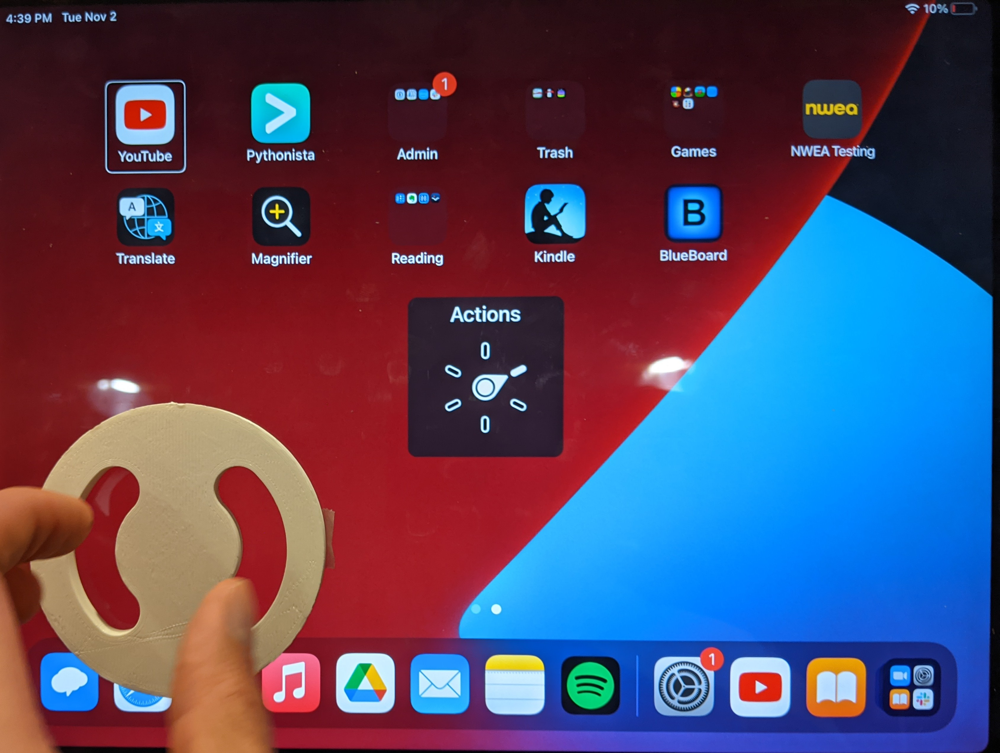

# OpenSCAD file for 3D printed VoiceOver rotor gesture guide

# Instructions
1. Download [OpenSCAD](https://openscad.org/downloads.html)
2. Open the file
3. Modify the file so that it fits your students fingers and device.
4. Print the mode. *Make sure the scale is correct! The base model is designed in inches.*
5. Use double stick tape to place the guide on a device and turn on voice over. *If double stick tape is not working try [this tape](https://www.amazon.com/Double-Sided-Mounting-Tape-Removable/dp/B094HP3G5M/ref=pd_lpo_2?pd_rd_i=B094HP3G5M&psc=1) for a stronger adhesion*

*Or skip steps 1-3 and just print the .stl file (3" diameter guide with .5" slots and .25" thickness)
